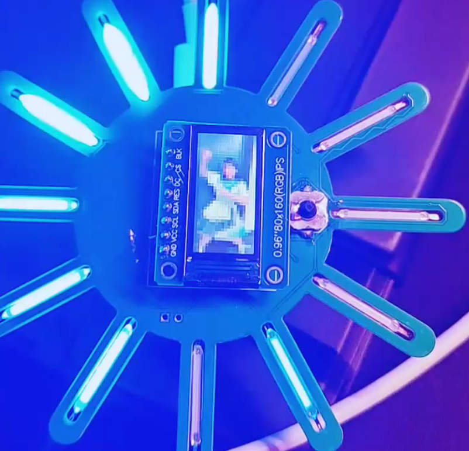

# 小日轮 (Nichirin)

<p align="center">
  
</p>

<p align="center">
  
  
  
  
  
</p>

<p align="center">小日轮 0.1.0-alpha.1</p>

> 基于 STM32G431 的视频+频谱流媒体与 LED 灯效系统，USB CDC 传输 80x160 RGB565 帧， 菜单驱动多模式灯效与参数设置。

## 目录

- [项目简介](#项目简介)
- [功能列表](#功能列表)
- [模式与参数](#模式与参数)
- [环境与依赖](#环境与依赖)
- [快速开始](#快速开始)
- [目录结构](#目录结构)
- [重新生成 CubeMX 代码](#重新生成-cubemx-代码)
- [常见问题](#常见问题)

## 项目简介

小日轮是一个将 USB CDC 视频流、音频频谱与 LED 灯效融合的展示工程。设备端使用 ST7735 LCD 与 12 灯 LED 条显示内容，PC 端通过 Python GUI 发送视频帧与音频频谱数据。 菜单提供模式切换、等级调节、保存与流媒体状态查看。

## 功能列表

- USB CDC 自定义协议：CRC16 校验、分包传输、PING/PONG
- 80x160 RGB565 LCD 流媒体显示
- 12 段音频频谱 LED 柱（流媒体模式下启用）
- 9 种花式 LED 灯效 + 1 个流媒体模式
- 等级参数 1~7 调节与 Flash 持久化
-  菜单：状态页、模式页、等级页、流媒体状态页

##  菜单

- **主页**：显示当前 Mode/Level/Dirty，进入菜单
- **主菜单**：Mode / Level / Mode 10 / Save Now / Back
- **模式选择**：上下切换 1~9 号模式，确认生效
- **等级调整**：左右/上下调整档位 1~7，确认返回
- **流媒体状态**：Seq/Status/FIFO 显示，提供 Stop

## 模式与参数

| 模式 | 灯效描述 | 参数含义 |
| --- | --- | --- |
| 1 | 正向单点流动 | 流动速度 |
| 2 | 反向单点流动 | 流动速度 |
| 3 | 中心向两侧扩散 | 流动速度 |
| 4 | 正向彗星拖尾 | 流动速度 |
| 5 | 反向彗星拖尾 | 流动速度 |
| 6 | 中心呼吸扩散 | 流动速度 |
| 7 | 全亮/全灭爆闪 | 爆闪周期 |
| 8 | 常亮 | 亮度 |
| 9 | 全灯呼吸 | 呼吸速度 |
| 10 | USB 流媒体 + 频谱 LED | 无 |

### 参数档位与具体数值

参数档位范围为 1~7，档位越大变化越快/更亮。

| 档位 | 流动周期 (ms) | 爆闪周期 (ms) | 常亮亮度 (0~255) | 呼吸周期 (ms) |
| --- | --- | --- | --- | --- |
| 1 | 240 | 300 | 100 | 6010 |
| 2 | 200 | 240 | 120 | 5330 |
| 3 | 160 | 200 | 140 | 4660 |
| 4 | 130 | 160 | 170 | 4000 |
| 5 | 110 | 130 | 200 | 3330 |
| 6 | 90 | 110 | 230 | 2660 |
| 7 | 70 | 90 | 255 | 2000 |

说明：
- 模式 1~6 使用“流动周期”作为速度参数
- 模式 7 使用“爆闪周期”
- 模式 8 使用“常亮亮度”
- 模式 9 使用“呼吸周期”
- 模式 10 为 USB 流媒体，自动切换频谱 LED

## 环境与依赖

| 组件 | 说明 | 备注 |
| --- | --- | --- |
| CMake | 3.22+ | 配置生成 |
| Ninja | 构建器 | 推荐 |
| ARM GNU Toolchain | `arm-none-eabi-gcc` | 需在 PATH 中 |
| Python | 3.8+ | 发送端 GUI |
| ffmpeg | 解码/音频提取 | 需在 PATH 中 |
| OpenCV | 可选 | 未安装则使用 ffmpeg |

Python 依赖：`numpy`, `pyserial`, `PyQt5`。

## 快速开始

### 1. 配置与编译（Debug）

```sh
cmake --preset Debug
cmake --build --preset Debug
```

### 2. Release 构建

```sh
cmake --preset Release
cmake --build --preset Release
```

### 3. 运行发送端

```sh
python tools/video_stream_sender_GUI.py
```

## 目录结构

```
nichirin/
├── Core/                    # 应用代码 (main, ISR, system)
├── Drivers/                 # CMSIS 与 HAL 驱动
├── Middlewares/             #  与 USB 中间件
├── USB_Device/              # USB CDC 设备栈
├── cmake/                   # 工具链与 CubeMX CMake 集成
├── tools/                   # PC 端发送工具
├── startup_stm32g431xx.s    # 启动文件
├── STM32G431XX_FLASH.ld     # 链接脚本
└── nichirin.ioc             # CubeMX 工程文件
```

## 重新生成 CubeMX 代码

1. 使用 STM32CubeMX 打开 `nichirin.ioc`
2. 重新生成代码（保持 CMake/Makefile 工程配置）
3. 按照 [快速开始](#快速开始) 重新构建

## 常见问题

**Q: 发送端提示找不到 ffmpeg？**  
A: 安装 ffmpeg 并确保在 PATH 中。

**Q: 串口列表为空？**  
A: 检查 USB CDC 设备是否枚举成功，必要时更换 USB 线或端口。
