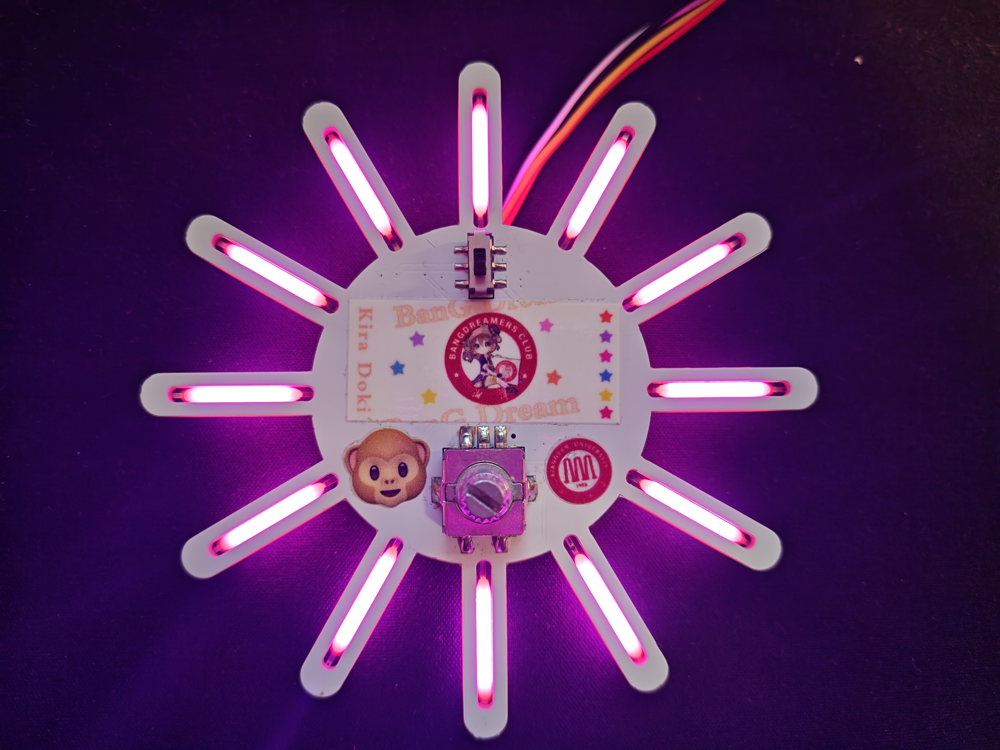

# Nichirin V2

<p align="center">
  
</p>

<p align="center">
  <a href="https://space.bilibili.com/6864209"></a>
  
  
  
  
</p>

> STM32G030xx 项目，基于 STM32CubeMX 生成，12 路 LED I2C 恒流驱动与旋转编码器交互。

## 目录

- [项目简介](#项目简介)
- [主要特性](#主要特性)
- [新功能详细说明](#新功能详细说明)
- [硬件与引脚](#硬件与引脚)
- [系统节拍与架构](#系统节拍与架构)
- [交互说明（编码器）](#交互说明编码器)
- [快速使用说明](#快速使用说明)
- [快速开始](#快速开始)
- [使用 AI](#使用-ai)
- [目录结构](#目录结构)
- [重新生成 CubeMX 代码](#重新生成-cubemx-代码)
- [常见问题](#常见问题)

## 项目简介

Nichirin V2 是基于 STM32G030 的 12 路 LED 灯效控制工程，使用 TLC59116 I2C 恒流驱动，输入为旋转编码器 A/B + 按下键。工程采用 SysTick 1ms/10ms 驱动状态机，无 RTOS。支持多模式灯效、参数调节、掉电记忆。

## 主要特性

### 灯效与亮度

- TLC59116 12 路恒流 PWM 调光（8-bit）
- 8 种灯效模式（流水/呼吸流动/爆闪/常亮/全灯呼吸）

### 交互与手感

- 编码器多击：单击 / 长按
- 旋转加速度：慢速 1 步、中速 4 步、快速 16 步
- 软阻尼：靠近边界更细腻

### 工程结构

- SysTick 1ms/10ms 驱动状态机，无 RTOS
- CMake 构建，CubeMX 生成代码

## 新功能详细说明

### 参数软阻尼（Soft Damping）

为改善旋钮手感，在接近边界时降低变化速度：

- 靠近 0 或 255 时需要更多 detent 才能变化 1
- 先应用加速度，再进入阻尼
- 可对不同参数设置不同阻尼强度

实现位置：Core/Src/ui_damping.c
关键宏：DAMP_ZONE_* / DAMP_GAIN_*

## 硬件与引脚

- **MCU**: STM32G030F6Px
- **I2C1**: SCL=PB3，SDA=PB7（与 TLC59116 相连）
- **编码器**: A=PA0，B=PA1，K=PA2，上拉输入
- **LED 驱动**: TLC59116，A0=GND，7-bit 地址 `0x60`

## 系统节拍与架构

- **1ms Tick**：`HAL_SYSTICK_Callback()` 内部调用 `Encoder_1msTick()`
- **10ms Tick**：主循环中每 10ms 调用 `Effect_Tick()`
- **无 RTOS**：所有逻辑由 SysTick 驱动的状态机完成
- **主循环简洁**：仅做初始化和周期调用

## 交互说明（编码器）

### 按键事件

| 事件 | 操作 | 说明 |
| --- | --- | --- |
| 单击 | 切换模式 | 在 1~8 模式间循环切换 |
| 长按 / 超长按 | 保存配置 | 将当前模式与参数写入 Flash，并通过短暂闪烁提示结果 |

### 旋转加速度

- 慢速：每 detent ±1
- 中速：每 detent ±4（默认阈值 120ms）
- 快速：每 detent ±16（默认阈值 60ms）

调整阈值与倍率：`Core/Src/drivers/encoder.c`

```c
#define ENCODER_ACCEL_MID_MS 120U
#define ENCODER_ACCEL_FAST_MS 60U
#define ENCODER_ACCEL_MID_STEP 4
#define ENCODER_ACCEL_FAST_STEP 16
```

## 快速使用说明

1. 上电默认进入运行态
2. 单击切换模式
3. 长按进入设置态，旋转修改当前模式参数；再长按退出

## 模式与参数

参数范围统一为 0~255。对“速度/周期”类参数：数值越大，周期越短、速度越快；对“亮度”类参数：数值越大越亮。

### 模式 1：正向单灯流水

- 效果：单灯正向依次点亮（沿环形顺序前进）。
- 参数：流水速度（0 慢、255 快）。

### 模式 2：反向单灯流水

- 效果：单灯反向依次点亮（与模式 1 方向相反）。
- 参数：流水速度（0 慢、255 快）。

### 模式 3：对称分组流水

- 效果：两两对称的灯对轮流点亮（共 6 组）。
- 参数：流水速度（0 慢、255 快）。

### 模式 4：正向呼吸流动

- 效果：带“软亮”光晕的单灯向前流动，周围灯呈呼吸式衰减。
- 参数：流水速度（0 慢、255 快）。

### 模式 5：反向呼吸流动

- 效果：与模式 4 相同，但方向相反。
- 参数：流水速度（0 慢、255 快）。

### 模式 6：全亮爆闪

- 效果：所有灯全亮/全灭交替闪烁。
- 参数：爆闪周期（0 慢、255 快）。

### 模式 7：常亮（全灯同亮度）

- 效果：所有灯常亮，亮度一致。
- 参数：常亮亮度（0 灭、255 最亮）。
- 保护：当亮度 > 200 且保持全亮模式连续 60 秒时，自动降到 128 以降低过热风险；当亮度调回 <= 200 或离开模式 7 时，保护计时与状态清零。

### 模式 8：全灯呼吸

- 效果：所有灯同步呼吸（亮暗起伏）。
- 参数：呼吸速度（0 慢、255 快）。

### 参数补充说明

- 流水/爆闪/呼吸速度均由当前模式的参数独立控制，互不影响。
- 长按进入设置态，旋转改变“当前模式”的参数；再长按退出并保存。

## 快速开始

### Debug 构建

```sh
cmake --preset Debug
cmake --build --preset Debug
```

### Release 构建

```sh
cmake --preset Release
cmake --build --preset Release
```

### 清理构建产物

```sh
cmake --build --preset Debug --target clean
```

### 构建产物

- `build/Debug/nichirin_V2.elf`
- `build/Debug/nichirin_V2.map`

## AI 辅助

本项目的部分迭代使用了 AI 辅助（Codex）进行代码重构与文档整理。AI 仅作为辅助工具，最终实现与行为以源码为准。若需复现改动，可在本仓库基础上提供同样的需求描述与约束，并结合实际硬件验证。

## 目录结构

```
nichirin_V2/
|-- Core/
|   |-- Inc/
|   |   |-- drivers/
|   |   |-- storage/
|   |   |   |-- flash_cfg.h
|   |   |   `-- cfg_store.h
|   |   `-- app/
|   `-- Src/
|       |-- app/
|       |-- drivers/
|       |-- storage/
|       |   |-- flash_cfg.c
|       |   `-- cfg_store.c
|       `-- main.c
|-- Drivers/
|-- cmake/
|-- assets/
|-- startup_stm32g030xx.s
|-- STM32G030XX_FLASH.ld
`-- nichirin_V2.ioc
```
## 重新生成 CubeMX 代码

1. 使用 STM32CubeMX 打开 `nichirin_V2.ioc`
2. 确保 I2C1 配置与工程一致
3. 重新生成代码（保留 USER CODE 区间）
4. 按照 [快速开始](#快速开始) 重新构建


## 常见问题

**Q: 旋转方向反了？**  
A: 交换 A/B 两相，或在 `Core/Src/drivers/encoder.c` 中交换读取顺序。

**Q: 编码器按键无响应？**  
A: 确认 K 脚上拉并低电平触发，去抖时间可在 `ENCODER_DEBOUNCE_MAX` 调整。

**Q: 掉电后配置丢失？**  
A: 请确认 `CFG_SLOT0_ADDR/CFG_SLOT1_ADDR` 与链接脚本不冲突，并确实有擦写权限。
